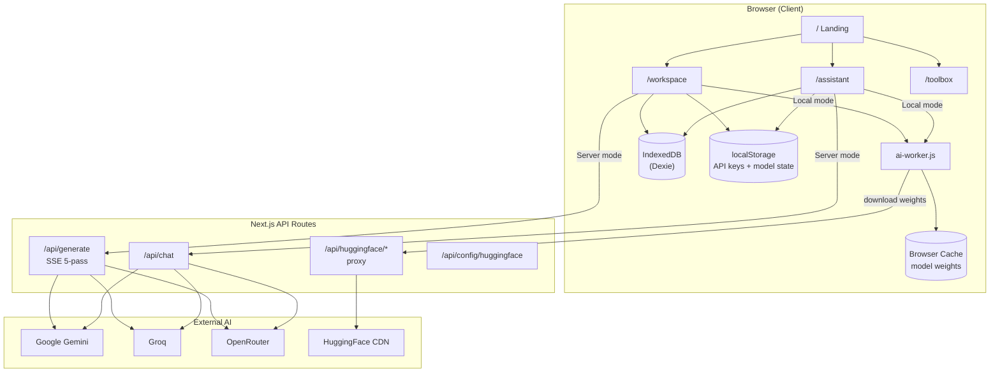

# Zentro

> **Browser-native, zero-install AI app builder** — LLM inference runs in your browser tab, not on someone else's server.

Zentro is a Next.js application that combines a **5-pass AI code generation workspace**, an **on-device chat assistant**, a **62+ offline developer toolbox**, and a **Bring Your Own API Key (BYOK)** system — all in one URL, with no account required.

---

## What Makes Zentro Different

| Feature | Zentro | Cursor / Bolt.new / v0 | Ollama / Dyad |
|---|---|---|---|
| LLM runs in-browser (WASM / WebGPU) | ✅ | ❌ (cloud inference) | ❌ (requires install) |
| Zero install, zero account | ✅ | ❌ | ❌ |
| 5-pass AI code generation pipeline | ✅ | ❌ | ❌ |
| Bring Your Own API Key | ✅ | ❌ | N/A |
| Live preview sandbox | ✅ | Partial | ❌ |
| On-device chat assistant | ✅ | ❌ | ✅ |
| Offline capability | ✅ (Local AI mode) | ❌ | ✅ |
| 62+ offline dev tools | ✅ | ❌ | ❌ |

---

## Project Structure

```
zentro/
├── public/
│   ├── ai-worker.js              # Web Worker — local LLM load, chat, 5-pass generation
│   └── sw.js                     # Service worker (offline PWA caching)
│
├── src/
│   ├── app/
│   │   ├── page.tsx              # Landing page (/)
│   │   ├── layout.tsx            # Root layout — Outfit font, metadata
│   │   ├── globals.css           # Tailwind v4 + theme tokens
│   │   ├── icon.tsx              # Dynamic favicon
│   │   │
│   │   ├── workspace/
│   │   │   └── page.tsx          # AI App Builder — editor, preview, 5-pass pipeline
│   │   ├── assistant/
│   │   │   └── page.tsx          # Chat assistant — personas, memory, model library
│   │   ├── toolbox/
│   │   │   └── page.tsx          # Offline developer utilities hub
│   │   │
│   │   └── api/
│   │       ├── generate/
│   │       │   └── route.ts      # SSE 5-pass code generation (Gemini / Groq / OpenRouter)
│   │       ├── chat/
│   │       │   └── route.ts      # Multi-turn chat completions (server engine)
│   │       ├── config/huggingface/
│   │       │   └── route.ts      # Check if server HF token is configured
│   │       └── huggingface/[[...path]]/
│   │           └── route.ts      # HF model download proxy (keeps token server-side)
│   │
│   ├── components/
│   │   ├── CodeEditor.tsx        # Monaco editor — HTML / CSS / JS tabs
│   │   ├── PreviewFrame.tsx      # Sandboxed iframe preview + console capture
│   │   ├── ModelDownloadOverlay.tsx  # Full-screen model download / compile progress UI
│   │   ├── ToolSystem.tsx        # 62+ tool registry + category router
│   │   └── tools/
│   │       ├── CodeIntelligence.tsx    # Regex, SQL, code explain, PGlite sandbox
│   │       ├── DevUtilities.tsx        # JSON, CSV, Base64, hash, color tools
│   │       ├── WritingLanguage.tsx     # Markdown, prompt improver, translator
│   │       ├── AiSimulationConsole.tsx # Offline AI simulation tools
│   │       └── RealMlTools.tsx         # Whisper transcription, OCR, image tools
│   │
│   ├── lib/
│   │   ├── modelDownloadProgress.ts  # Progress types, byte formatting, localStorage keys
│   │   └── modelLoadErrors.ts        # User-friendly error messages (OOM, auth, network)
│   │
│   └── services/
│       └── db.ts                 # Dexie.js — chats, messages, project drafts (IndexedDB)
│
├── tests/
│   └── vibebuilder.spec.ts       # Playwright E2E tests
│
├── next.config.ts                # COOP/COEP headers for WASM SharedArrayBuffer
├── playwright.config.ts
├── package.json
├── .env                          # API keys (never commit)
└── README.md
```

---

## Architecture

### High-Level Flow



### Local AI Worker (`public/ai-worker.js`)

The worker runs `@huggingface/transformers` v3.5.2 off-thread and handles three message types:

| Message type | Purpose |
|---|---|
| `load` | Download + compile a quantized ONNX model |
| `generate` | 5-pass workspace code generation (local) |
| `chat` | Assistant multi-turn chat (local) |
| `transcribe` | Whisper speech-to-text (toolbox) |

**Load pipeline:**

```
1. Verify HF proxy reachable
2. Try dtype: q4 → q8 → fp32 (large models: q4 only)
3. Stream download progress → aggregate byte tracker
4. Auto-switch to "Compiling for WebGPU" phase at 93–98%
5. Post ready → UI closes overlay, marks model ready in localStorage
```

**Progress tracking (`createDownloadTracker`):**
- Uses **max weight file bytes** (not sum) to avoid inflated totals across ONNX variants
- Compares against `expectedSizeMB` from model library metadata
- Phases: `download` (0–90%) → `compile` (93–98%) → `ready` (100%)

**Memory safety:**
- Models ≥ 1.2 GB: single `q4` attempt only (no dtype retries)
- OOM errors (`Array buffer allocation failed`) → friendly error + model library suggestion
- `unhandledrejection` handler catches escaped OOM in progress callbacks

### Model State Persistence

| localStorage key | Value |
|---|---|
| `zentro-local-model` | Last selected / loaded model HuggingFace ID |
| `zentro-local-model-ready` | `"true"` when model successfully compiled |
| `zentro-key-{provider}` | BYOK API keys (gemini, groq, openrouter, huggingface) |
| `zentro-theme` | `dark` or `light` |
| `zentro-memories` | Assistant memory facts (JSON array) |
| `zentro-active-persona` | Active assistant persona ID |

On page refresh: if `zentro-local-model-ready` is set, the worker auto-restores the model from browser cache (fast, no re-download).

---

## Pages & Routes

### `/` — Landing Page
Marketing page: feature grid, 5-pass pipeline explainer, toolbox preview, architecture comparison table.

### `/workspace` — AI App Builder
Three-panel IDE layout:

| Panel | Contents |
|---|---|
| Left sidebar | Session history, 5-pass pipeline status indicators |
| Center | Monaco code editor (HTML/CSS/JS) + prompt chat input |
| Right | Live sandbox preview with console log capture |

**Engine modes:**
- **Server Engine** — Gemini / Groq / OpenRouter via `/api/generate` (SSE)
- **Local AI (Offline)** — Web Worker + transformers.js

**Features:** ZIP export, dark/light theme, BYOK API key manager, model download overlay, auto-restore on refresh.

### `/assistant` — Chat Assistant
Full chat UI with:
- Multi-session history (IndexedDB)
- **Personas** — Vibe Coder, Mentor, Debugger, Analyst, custom personas
- **Memory system** — persistent facts across sessions
- **Power Mode** — rich HTML response rendering
- **Model Library modal** — browse 30+ local models with size/category metadata
- Same BYOK + server/local engine switch as Workspace

### `/toolbox` — Offline Developer Tools
62+ utilities across 11 categories, routed by `ToolSystem.tsx`:

| Category | Example tools |
|---|---|
| Code Intelligence | Regex sandbox, SQL assistant, code explainer |
| Writing & Language | Markdown studio, prompt optimizer, translator |
| Data & Sheets | CSV ↔ JSON, YAML ↔ JSON, chart builder |
| Dev Utilities | JSON formatter, Base64, hash generator |
| Privacy & Security | AES tools, password generator |
| Audio & Voice | Whisper transcription (via ai-worker) |
| Vision & Image | OCR, background remover, image tools |

---

## API Routes

| Route | Method | Purpose |
|---|---|---|
| `/api/generate` | POST | 5-pass SSE code generation pipeline |
| `/api/chat` | POST | Multi-turn chat (server engine) |
| `/api/huggingface/[[...path]]` | GET | Proxy HF model file downloads; forwards `Content-Length` for progress |
| `/api/config/huggingface` | GET | Returns `{ configured: true/false }` for server HF token |

### HuggingFace Proxy
Model weights are downloaded through the Next.js proxy so the server `.env` token never reaches the browser. The worker sends `X-HF-Token` header when the user has a BYOK HuggingFace key.

Required response headers forwarded: `Content-Type`, `Content-Length`, `Content-Disposition`, `ETag`.

---

## 5-Pass Generation Pipeline

### Server mode (SSE via `/api/generate`)

```
Pass 1 → Analyze     Parse intent, extract app name & feature list
Pass 2 → Plan        Step-by-step architecture blueprint
Pass 3 → Generate    Write full single-page HTML / CSS / JS
Pass 4 → Self-Review Audit tags, scripts, layout bugs
Pass 5 → Polish      Gradients, glassmorphism, animations, dark mode
```

Each pass streams live into the editor and pipeline status indicators update in real time.

### Local mode (Web Worker)
Same 5-pass flow runs inside `ai-worker.js` using the loaded local model. Passes 4–5 use client-side heuristics (no extra inference calls).

---

## AI Providers & Models

### Server Engine (requires API key)

| Provider | Example models | Env var |
|---|---|---|
| Google Gemini | `gemini-2.5-flash`, `gemini-2.0-flash`, `gemini-2.5-flash-lite` | `GEMINI_API_KEY` |
| Groq | `llama-3.3-70b-versatile`, `llama-3.1-8b-instant` | `GROQ_API_KEY` |
| OpenRouter | `meta-llama/llama-3.1-8b-instruct:free`, `google/gemma-2-9b-it:free` | `OPENROUTE_API_KEY` |

### Local AI (Offline / In-Browser)

Runs via `@huggingface/transformers` 3.5.2 in a Web Worker (WASM backend).

| Model | Size | RAM needed | Notes |
|---|---|---|---|
| `Xenova/LaMini-GPT-124M` | ~250 MB | ~1 GB | Fastest, lowest RAM |
| `Xenova/Qwen1.5-0.5B-Chat` | ~300 MB | ~1 GB | Good balance |
| `Xenova/TinyLlama-1.1B-Chat-v1.0` | ~650 MB | ~2 GB | Recommended starter |
| `onnx-community/Qwen2.5-1.5B-Instruct` | ~1.56 GB | ~4 GB | Strong chat quality |
| `onnx-community/Qwen2.5-Coder-1.5B-Instruct` | ~1.56 GB | ~4 GB | Best for code generation |
| `Xenova/Phi-3-mini-4k-instruct` | ~2.3 GB | ~5 GB | Top quality, high RAM |

Models ≥ 1.2 GB only attempt `q4` quantization to avoid OOM from dtype retries.

---

## API Key Setup

### Option 1 — Server `.env` (shared default)

```env
GEMINI_API_KEY=AIza...
GROQ_API_KEY=gsk_...
OPENROUTE_API_KEY=sk-or-...
HUGGING_FACE_TOKEN=hf_...
```

### Option 2 — Bring Your Own Key (per-user, in-browser)

Click **API Keys** in the Workspace or Assistant header.

- Keys stored in `localStorage` only — never sent to Zentro servers
- User keys take priority over `.env` server defaults
- Removing a key reverts to the server default

| Provider | Key format |
|---|---|
| Google Gemini | `AIza...` |
| Groq | `gsk_...` |
| OpenRouter | `sk-or-...` |
| Hugging Face | `hf_...` |

---

## Data Layer

### IndexedDB (Dexie — `src/services/db.ts`)

| Table | Fields | Purpose |
|---|---|---|
| `chats` | id, title, type, createdAt, updatedAt | Chat sessions (`builder` or `assistant`) |
| `messages` | id, chatId, role, content, files, passDetails | Messages with optional HTML/CSS/JS output |
| `projects` | id, name, html, css, js, updatedAt | Saved project drafts |

### Browser Cache
Model ONNX weights cached by transformers.js after first download. Subsequent loads (including after page refresh) load from cache in seconds.

---

## Security & Headers

`next.config.ts` sets cross-origin isolation headers required for WASM threading:

```ts
Cross-Origin-Opener-Policy: same-origin
Cross-Origin-Embedder-Policy: credentialless
```

These enable `SharedArrayBuffer` in the transformers.js WASM backend while still allowing CDN resources.

---

## Getting Started

```bash
git clone <repo-url>
cd zentro
npm install

# Add API keys
cp .env.example .env   # then edit .env

npm run dev            # http://localhost:3000
npm run build          # production build
npm start              # production server
```

---

## Testing

```bash
npm test               # Playwright headed
npm run test:ui        # Playwright UI mode
npx playwright show-report
```

E2E tests in `tests/vibebuilder.spec.ts` cover:
- Workspace UI load
- 5-pass pipeline trigger
- Toolbox rendering
- API key manager modal

---

## Tech Stack

| Layer | Technology |
|---|---|
| Framework | Next.js 16 (App Router) |
| UI | React 19, Tailwind CSS v4 |
| Font | Outfit + Geist Mono (Google Fonts) |
| Icons | Lucide React |
| Local AI | `@huggingface/transformers` 3.5.2 (WASM, Web Worker) |
| Database | Dexie.js 4 (IndexedDB) |
| Code Editor | Monaco Editor (`@monaco-editor/react`) |
| Export | JSZip |
| Testing | Playwright |
| AI Providers | Google Gemini, Groq, OpenRouter |

---

## Privacy

- **Local AI mode** — inference runs entirely in-browser; no data leaves the device after model download
- **BYOK keys** — stored in `localStorage`, sent directly to AI providers per request
- **Server mode** — requests routed through Next.js API routes using `.env` or user-supplied keys
- **HF proxy** — server token never exposed to browser; user BYOK token sent as `X-HF-Token` header only to the local proxy

---

## Environment Variables

| Variable | Required | Description |
|---|---|---|
| `GEMINI_API_KEY` | For Gemini models | [Google AI Studio](https://aistudio.google.com) |
| `GROQ_API_KEY` | For Groq models | [Groq Console](https://console.groq.com) |
| `OPENROUTE_API_KEY` | For OpenRouter models | [OpenRouter Keys](https://openrouter.ai/keys) |
| `HUGGING_FACE_TOKEN` | For gated HF models | [HF Settings → Tokens](https://huggingface.co/settings/tokens) |
